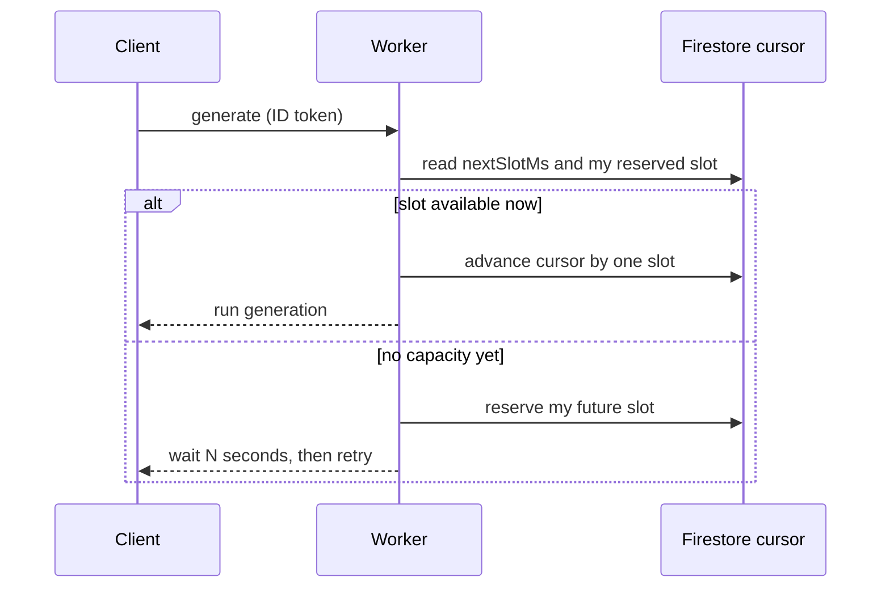

Two people finish onboarding in my workout app within the same second on a Sunday afternoon. Both trigger a program generation. Both hit the same Gemini free-tier quota, because there is only one quota for the whole app, free users and subscribers alike. The free tier allows a request roughly every four seconds. I have two requests in the same instant. One of them has to wait.

This is a completely ordinary rate-limiting problem, right up until you notice where the code enforcing it runs. It runs in a Cloudflare Worker. A Worker cannot wait. It wakes up, does its work, returns a response, and vanishes. There is no long-lived process holding a lock, no thread parked on a queue, nowhere for a request to stand in line.

So I needed a queue for a shared quota, enforced by a runtime that has no memory between requests and cannot pause. This issue is how that gets built, and why the answer is smaller than it sounds.

## Why the obvious tools do not fit

The textbook answers assume state that outlives a request. A token bucket lives in memory somewhere and refills over time. A lock is held by a process while others block on it. A queue is a service that keeps requests in order while workers pull from it.

A Worker has none of that. Each invocation starts cold, has no shared memory you can rely on across requests, and is billed to finish quickly rather than to sit and wait. If I park a request for thirty seconds waiting for a slot, I am paying for thirty seconds of doing nothing, and the platform would rather I did not.

I could bolt on a real queue service, or a Redis instance, or a Durable Object to hold the state. But the whole project runs on free tiers by design, and every one of those is either a new dependency, a new cost, or both. The constraint pushed me to ask a smaller question: what is the least state I need, and where can it live that already exists?

It turns out the answer is a single number, and it can live in the database I already have.

## The reservation cursor

The state is one value in Firestore called `nextSlotMs`: the earliest moment at which the next generation is allowed to run. That is the whole shared state. Not a queue of requests, just a cursor pointing at the next free moment on the timeline.

When a request arrives, the Worker reads the cursor and decides one of a few things.

If there is capacity right now, it runs immediately and pushes the cursor one slot into the future, so the next caller sees a later free moment. If the moment has not arrived yet, the caller does not wait in the Worker. Instead it is handed its own distinct future slot, told how many seconds until that slot matures, and asked to come back then. When it comes back and its reserved time has arrived, it runs.

So the queue is not a queue of parked requests. It is a set of reservations spread across future time, and each client holds its own place by remembering when to return. The waiting happens on the client, not in the Worker, which is exactly where a stateless runtime wants it.

The client's retry is not a workaround for a busy server; it is how the client occupies its place in line.

## The details that keep it honest

A single shared number sounds fragile, and it would be if I ignored the sharp edges. A few decisions keep it trustworthy.

**Reservations are forgery-proof.** A caller's reserved slot is stored against their user id, and that field is written by the server, not sent by the client. A client cannot post an earlier slot to jump the line, because it does not get to write the field that decides its place.

**Nobody waits forever.** There is a maximum wait. If the line is longer than that, the request is rejected outright with a retry-after rather than promised a slot deep into next week. A bounded wait is a better user experience than an unbounded promise, and it protects the system from a pile-up on a busy day.

**The caps sit under the real limit.** The free tier allows around fifteen requests a minute; I cap the app well below that, closer to eight. Two reasons. The read-modify-write on the cursor is not atomic, so two requests can occasionally race and both think they have a slot. And a single generation can fire a second model call on a retry, so one logical request is sometimes two real ones. Leaving headroom absorbs both. When the cost of being wrong is a rejected user, headroom beats precision.

I want to be honest that this is a shortcut with a known ceiling. The non-atomic read-modify-write means that under a genuine thundering herd, the cap can be breached by a little. The headroom is what makes that safe rather than fatal, and if the app ever moves off the free tier, the right upgrade is a real atomic counter or a Durable Object. Until then, one number and some slack is the correct amount of engineering.

## The part that made it testable

The nicest consequence was accidental. All the branching logic, decide whether to run now, reserve a slot, or reject, lives in one pure function. It takes the current state and the clock and returns a decision. It imports nothing. The Worker does the actual database read and write around it, but the thinking is separate.

That means the hard part tests under a plain `node rateLimit.test.ts` with no framework, no mocked database, no Worker runtime. You feed it a state and a timestamp, you assert the decision. Every awkward case, the daily budget being spent, a matured reservation, two callers in the same millisecond, is a couple of lines.

The general move is worth stealing. When the thing you are testing is a decision, separate the decision from the input and output. A pure function that takes state and returns a verdict is trivial to test exhaustively; a function that also reads the database and writes the response is not. Push the effects to the edges and keep the judgement in the middle.

## Common mistakes

1. **Parking a request to make it wait in a runtime billed to finish fast.** On a serverless platform, holding a request open to wait for a slot burns time you pay for and fights the execution model. Move the waiting to the client with a reserve-and-retry protocol.

2. **Trusting a slot the client sent you.** If the client can write the field that decides its place in line, someone will write an earlier one. Key the reservation to a server-written identifier so it cannot be forged.

3. **Setting the cap at the exact provider limit.** Non-atomic updates and retry-driven double calls mean your real traffic overshoots your intended rate. Cap under the limit and leave headroom, and treat the shortcut's ceiling as something you have named, not something you have hidden.

4. **Mixing the decision with its side effects.** A rate-limit rule tangled with database reads and HTTP responses is hard to test and easy to get subtly wrong. Keep the decision in a pure function and let the caller perform the effects.

## The takeaway

You can rate-limit a shared quota from a stateless runtime without a queue service, a lock, or an in-memory bucket. Keep one value, the earliest moment the next call may run, and turn waiting into a client-side reservation: hand each caller a future slot and let it come back when the slot matures. Make the reservation forgery-proof by keying it to a server-written id, bound the wait, and cap under the real limit to absorb races and retries. Then keep the decision logic in a pure function so the awkward cases test in isolation.

## Production checklist

- Store the minimum shared state a rate limiter needs, ideally a single "next allowed time" cursor, in a store you already run.
- Move waiting off the server with a reserve-and-retry protocol that hands each caller a future slot and an eta.
- Key every reservation to a server-written identifier so a client cannot forge an earlier place in line.
- Bound the maximum wait and reject beyond it with a retry-after, rather than promising an unbounded delay.
- Set the enforced cap below the provider's real limit to absorb non-atomic updates and retry-driven double calls.
- Name the shortcut's ceiling in a comment and record the upgrade path, such as an atomic counter, for when you outgrow it.
- Keep the run-reserve-reject decision in a pure function that takes state and a clock and returns a verdict, and test it without a framework.
