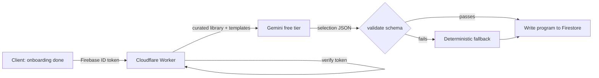
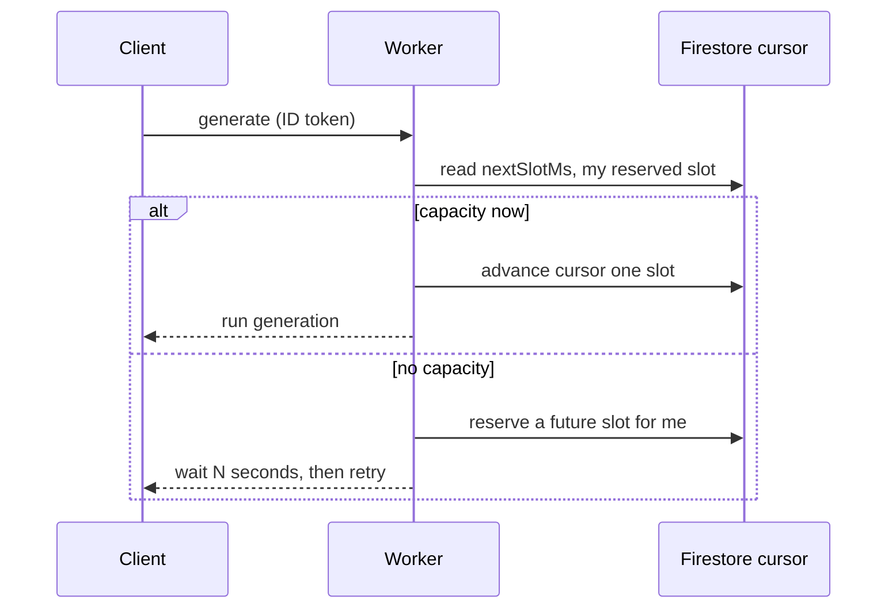

I have a workout tracker I have been using for about three months. It logs every set, shows me what I lifted last time, and syncs across my phone and laptop. It is a small React app on Firebase. Nothing clever.

Then I wanted it to write training programs. Not for me, I already had one. For anyone who signed up: a real onboarding flow, a generated split, weekly coaching notes on a Sunday. The obvious way to do that is to call a model. The obvious way to pay for that is a credit card on the Anthropic or OpenAI dashboard.

I did not want a credit card anywhere. Not on Google Cloud, not on Cloudflare, not on Firebase. The whole point was to see if a real AI feature could run on free tiers alone, and stay there until it had actual users worth paying for.

It can. The project is called Transform, and this issue is what building it taught me. The short version: the model was the easy part, and the thing that nearly broke the free-tier budget was not tokens at all.

## The rule that made the LLM safe: it selects, it never creates

The first decision was the one that made everything after it calmer. The model does not write your program. It picks from a menu.

There is a curated exercise library, roughly forty-five movements, each tagged with the muscle it works, the equipment it needs, and the movement pattern. There is a set of proven training splits: upper-lower four days, full-body three days, push-pull-legs six days. When someone finishes onboarding, the model's job is narrow. Choose a template. Fill each slot with an exercise from the library. Set the reps and the starting weight.

That is it. It never invents an exercise. It never free-forms a program out of its own head. It selects.

This sounds like a limitation, and it is, and that is the point. A model that can only choose from a known set can only fail in known ways. It can pick a bad exercise, but it cannot pick an exercise that does not exist. It can choose an odd template, but it cannot return a program shaped like nothing your app can render.

Here is the shape of the request path once you commit to that rule.

The client sends its Firebase ID token to a Cloudflare Worker; the Worker verifies the token, asks Gemini to choose, validates the answer, and only then writes anything.

Two boxes in that diagram are doing more work than they look like they are. Let me take them in turn.

## Validate everything the model returns, before it touches your database

The model's output is a suggestion until it has been checked. I treat it exactly that way.

There is a `validate.ts` that every generated program passes through before a single field reaches Firestore. It is strict on purpose. Unknown template id, rejected. An exercise id that is not in the library, rejected. The same exercise slotted twice in one workout, rejected. Sets that are not a sensible integer, reps that are not a real string, a starting weight that is negative, all rejected.

None of this is exotic. It is the boring schema check you would write for any untrusted input. The mindset shift is treating the model as an untrusted input in the first place. It is not a colleague handing you a program. It is a network call that usually returns something good and occasionally returns something strange, and the occasionally is the part your users will find.

The rule I would give anyone wiring an LLM into a product: never write model output to storage without validating it first, and keep the validator strict enough that a rejected answer costs you nothing.

That last clause only works because of the next box.

## Have a deterministic fallback that is correct by construction

A validator that rejects bad output is only half a plan. What happens when the model is down, or rate-limited, or returns something your validator throws out at two in the morning?

You need an answer that does not involve the model at all. Transform has one. It is a plain function, `fallback.ts`, that selects exercises deterministically: walk the template's slots, pick a matching exercise from the library for each, respect the user's equipment. No network, no tokens, no waiting. It always returns a program that the assembler can turn into valid output, because it is built from the same library the validator checks against.

So the model is an enhancement, not a dependency. When Gemini answers well, you get a slightly smarter program. When it does not, you get a solid one anyway, and the user never sees an error page.

I did not design this upfront out of good taste. I designed it because generation returned a 500 in production for anyone on a home-gym equipment setting, since the library had a gap for one role-and-equipment combination and the code assumed a match always existed. The fallback is what a crash teaches you to build. The lesson is cheaper if you build it before the crash: any time an LLM sits on your critical path, ask what your app does when the model gives you nothing useful, and make that path a real one you have tested.

## The bottleneck was not the model. It was Firestore writes.

Here is the part I did not expect, and the reason I wanted to write this up.

I spent real effort worrying about Gemini's free tier. It gives you roughly fifteen requests a minute and fifteen hundred a day. I did the arithmetic. One program generation per signup, one coaching note per user per week. Even at a hundred signups a day, I was nowhere near the ceiling. Tokens were never going to be the problem.

The problem was Firestore. Consider what a workout actually is: someone does ten exercises, four sets each. If you write one document per set, that is forty writes for one session. Now put a hundred users through four sessions a week. That is around 228,000 writes a day. The free Spark plan gives you twenty thousand writes a day. You blow through it with a fraction of the users you were happily generating programs for.

The shiny resource, the LLM, had enormous headroom. The boring resource, the database write, was the real wall. I had been staring at the wrong meter.

The fix is not a billing change. It is a code change. Collect every set from one workout on the client and write it as a single document instead of forty. That is roughly a fortyfold reduction, and it turns a plan-breaking write pattern into one that stays free for a long time. Batch first, upgrade the plan later if you ever need to.

If there is one transferable lesson in this whole project, it is that one. When you are working inside a budget, profile the resource nobody is talking about, not the one on the marketing page.

## Rate-limiting a runtime that cannot wait

There is a second free-tier problem that is more interesting than it sounds, and it comes straight out of the architecture.

Every generation, whether the user is a free signup or a subscriber, hits the same Gemini free-tier quota. There is one budget for everyone. So I need a global queue, not a per-user limit. Fine. Except the thing enforcing the queue is a Cloudflare Worker, and a Worker cannot hold a request open while it waits its turn. It runs, it responds, it is gone. There is nowhere to stand in line.

So the queue is not a queue. It is a reservation cursor in Firestore. There is a single value, `nextSlotMs`, that says the earliest moment the next generation is allowed to run. Each caller reads it, and if there is room, it runs and pushes the cursor one slot into the future. If the budget is spent for the moment, the caller is handed a distinct future slot, told how many seconds to wait, and asked to come back then. When it comes back and its reserved time has arrived, it runs.

A few details make it hold together. The reservation is keyed to the user's uid, and that field is written by the server, so a client cannot forge a slot to jump the line. There is a maximum wait, so nobody is queued forever behind a busy day. And I set the caps deliberately under the real limit, around eight requests a minute against a ceiling of fifteen, because the read-modify-write on that cursor is not atomic and a single generation can fire a second call on a retry. Headroom beats precision when the cost of being wrong is a rejected user.

The decision logic lives in a pure function with no imports, which means it runs under a plain `node rateLimit.test.ts` with no framework. When the thing you are testing is a scheduling rule, make it a function that takes state and returns a decision, and the test writes itself.

## Common mistakes

1. **Letting the model produce free-form output you then try to parse loosely.** The moment the model can return arbitrary shapes, your parser becomes the least reliable part of the system. Constrain the output to a selection from a known set, and validate that selection strictly. A rejected answer should be cheap, not a crisis.

2. **Treating the LLM as infrastructure you can depend on.** Free tiers go down, rate-limit you, and occasionally return nonsense. If the model sits on a path a user is waiting on, you need a deterministic answer for when it fails, and you need to have actually run that path. An untested fallback is a second bug waiting behind the first.

3. **Optimising the resource you can see and ignoring the one you cannot.** I watched the token meter and missed the write meter by an order of magnitude. Before you scale anything, work out which free-tier limit you hit first at ten times your current load, and it is rarely the one you were worried about.

4. **Reaching for infrastructure a constraint does not need.** A stateless Worker plus one Firestore value gave me a global rate limiter. No queue service, no Redis, no durable object. The constraint of "must stay free" pushed me toward a smaller design, and the smaller design was genuinely better, not just cheaper.

## The takeaway

You can put a real AI feature into production without paying for anything, if you are willing to let the constraint shape the design instead of fighting it. Keep the model on a short leash: it selects from a curated set, it never invents, and everything it returns is validated before it is trusted. Give it a deterministic fallback so it is an enhancement and not a dependency. Then spend your scaling worry on the boring resource, because the database write, not the token, is what runs out first.

The whole thing runs on Firebase Spark, Cloudflare Workers free, and Gemini free tier, and it will keep running there until it has enough real users that paying a little becomes an easy decision.

## Production checklist

- Constrain the model to selecting from a curated set of options rather than generating free-form output, so it can only fail in ways you have enumerated.
- Write a strict schema validator that every model response passes before any field reaches your database, and reject unknown ids, duplicates, and out-of-range values outright.
- Build a deterministic, no-model fallback that is correct by construction, and route to it whenever the model is down or its output fails validation.
- Test the fallback path as a first-class path, not as an afterthought you assume works.
- Keep all model and admin credentials in server-side secrets, and have the client authenticate to your backend with a verifiable token rather than calling the model directly.
- Work out which free-tier limit you hit first at ten times current load, and fix that one before you touch anything else.
- Batch related writes into a single document where your data model allows it, and measure the write count per user action before you scale.
- Set rate-limit caps below the real ceiling to absorb retries and non-atomic updates, and key any reservation to a server-written identifier so it cannot be forged.
- Keep scheduling and rate-limit decisions in pure functions that take state and return a decision, so they test without a framework.
