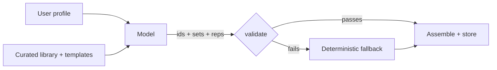

A user finishes onboarding in my workout app on a Tuesday evening. Height, weight, age, goal, the equipment they have at home. They tap "build my program" and wait. Somewhere behind that spinner, a language model is about to decide what they train for the next several weeks.

That sentence used to make me nervous. A model deciding a real person's training, with no engineer in the loop, off a free-tier API that occasionally returns something strange. The nervousness went away when I changed one thing about how the model was allowed to answer.

The model does not write the program. It chooses from a menu. This issue is about why that single constraint, plus two guardrails behind it, turned a scary feature into one I rarely think about.

## Why free-form generation is the wrong default

The tempting design is to hand the model the user's profile and ask it for a program. It will give you one. It will look great in the demo. It will also, on some fraction of real requests, give you a program with an exercise your app has never heard of, a rep scheme in a format your renderer chokes on, or a structure that is subtly nonsense.

The problem is not that the model is bad. It is that free-form output has an unbounded shape. Anything the model can express, it might express, and your code downstream has to survive all of it. Your parser becomes the least reliable component in the system, because it is trying to be robust against an input space with no edges.

You feel this most at the boundary where model output meets storage. Once a malformed program is written to your database, it is not a transient error any more. It is a corrupt record a real user will open tomorrow.

## The reframe: selection, not creation

So I gave the model edges. There is a curated exercise library, roughly forty-five movements. Each one is tagged with the muscle it works, the equipment it needs, and its movement pattern. There is a small set of proven training splits: upper-lower four days, full-body three days, push-pull-legs six days.

The model's job is now narrow and closed. Pick a template. For each slot in that template, pick an exercise from the library. Set the reps and a sensible starting weight. That is the entire surface it is allowed to touch.

It cannot invent an exercise, because it can only reference ids that already exist. It cannot return a program shaped like nothing the app renders, because the template defines the shape. The intelligence is still doing real work, choosing well for this person, but it is choosing, not composing from nothing.

The model receives the menu and returns choices; everything after it assumes those choices might still be wrong.

The wider lesson travels well beyond fitness. When you are tempted to ask a model to generate, ask first whether the task is really a selection from a set you control. Routing, classification, tool choice, picking a template, tagging: a large share of the LLM features people ship as open generation are selection problems wearing a costume. Give them edges and they get safer for free.

## Guardrail one: validate before anything is trusted

Choices from a closed menu are safer, not safe. The model can still pick the same exercise twice, or return three sets where the schema wants an integer between one and ten, or hand back an empty reps string.

So every response passes through a strict validator before a single field is written. Unknown template id, rejected. An exercise id that is not in the library, rejected. A duplicate movement inside one workout, rejected. Sets that are not a sensible integer, reps that are not a real non-empty string, a negative starting weight, all rejected.

There is nothing clever in that list. It is the same boring input validation you would write for a form submitted by a stranger. The only shift is deciding that the model is a stranger. Not a teammate whose output you trust, but a network call that usually returns something good and sometimes does not, and the sometimes is exactly what your users will find first.

The rule, stated plainly: never write model output to storage without validating it, and keep the validator strict enough that rejecting an answer costs you nothing. That last clause is doing a lot of work, and it only holds because of the next guardrail.

## Guardrail two: a deterministic fallback that cannot fail

A validator that rejects bad output is only half a design. You have to answer the question it raises: what happens when the model is down, or rate-limited, or returns something the validator throws out, at two in the morning when you are asleep?

The answer has to be an answer that does not involve the model at all. There is a plain function that selects exercises deterministically. It walks the template's slots, and for each one it picks a matching exercise from the library that fits the user's equipment. No network, no tokens, no waiting. It always returns a program the assembler can build, because it draws from the same library the validator checks against, so its output is valid by construction.

That makes the model an enhancement rather than a dependency. A good answer from Gemini gives you a slightly smarter selection. A bad answer, or no answer, gives you a solid program anyway, and the user never sees an error.

I would like to say I designed this out of foresight. I designed it because generation returned a 500 in production for users on the home-gym equipment setting. The library had a gap for one role-and-equipment combination, and the code assumed a match always existed. A crash taught me the fallback. The lesson is a lot cheaper if you learn it before the crash: whenever a model sits on a path a user is waiting on, decide what your app does when the model gives you nothing, and make that a real, tested path.

## The part nobody sees is the part that matters

Here is the quiet truth of the whole feature. The exercise library is the product, not the model.

The model is a few hundred tokens of prompt and a fetch call. The library is where the judgement lives: which movements are worth including, how they are tagged, which splits are actually sound. Swap the model for a different one and the app behaves about the same. Degrade the library and the app gets worse no matter how good the model is.

That is worth sitting with if you are building anything LLM-shaped. The model is rented and interchangeable. Your curated data, your schema, and your validation are the assets you own and the reason the output is trustworthy. Spend accordingly.

## Common mistakes

1. **Asking the model to generate when the task is really selection.** If the valid answers come from a set you control, give the model that set and let it choose. Open generation over a closed problem just hands you an unbounded output space to defend against for no benefit.

2. **Trusting model output because it usually looks right.** "Usually" is a production incident waiting for the request that does not. Validate every response against a strict schema, and treat the model as an untrusted input, because from your database's point of view that is exactly what it is.

3. **Writing a validator with no fallback behind it.** Rejection is only cheap if there is a correct answer waiting when you reject. A deterministic path that is valid by construction turns a model failure into a non-event.

4. **Leaving the fallback untested.** The fallback runs precisely when things are already going wrong, which is the worst time to discover it has a bug. Exercise it in tests as a first-class path, not as an afterthought you assume works.

## The takeaway

The way to make an LLM feature calm to operate is to shrink what the model is allowed to do and to distrust what it returns. Let it select from a curated set instead of generating freely, so it can only fail in ways you have enumerated. Validate every answer before it is stored. Keep a deterministic fallback that is correct by construction, so the model is an enhancement and never a dependency. And remember that the curated data, not the model, is the thing you are really building.

## Production checklist

- Decide whether your task is selection from a known set before you reach for open generation, and constrain the model to that set when it is.
- Represent the choosable set as stable ids the model must reference, so it cannot name something that does not exist.
- Run every model response through a strict schema validator before any field reaches storage, rejecting unknown ids, duplicates, and out-of-range values.
- Build a deterministic, model-free path that is valid by construction, and route to it on any model failure or validation rejection.
- Test the fallback as a first-class path with its own assertions, not as an assumed safety net.
- Keep model credentials in server-side secrets and call the model from your backend, never directly from the client.
- Invest in the curated data and schema behind the feature, and treat the model itself as replaceable.
