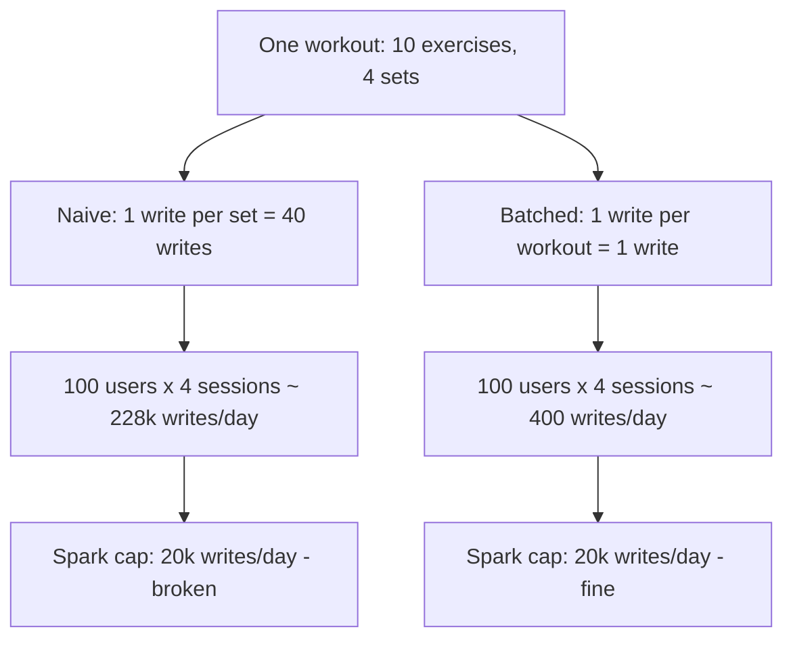

When I decided to add AI-generated training programs to my workout app, the first thing I did was open a spreadsheet and work out the token cost. That felt responsible. It was also the wrong meter to be watching, and it took a back-of-the-envelope scare a month later to notice.

The rule I set for the project was simple and slightly stubborn: zero recurring cost, and no credit card on any dashboard. Not on Google Cloud for the model, not on Cloudflare for the backend, not on Firebase for the database. If a design needed a paid plan, the design was wrong and I would find another one.

That constraint did something I did not expect. It did not just save money. It made me design a better system, because it forced me to look hard at which resource actually runs out first. This issue is about that resource, and it is almost never the one on the marketing page.

## The meter I was watching

Gemini's free tier gives you roughly fifteen requests a minute and fifteen hundred a day. So I did the arithmetic that everyone does. One program generation per new signup. One coaching note per user per week. Even at a hundred signups in a single day, that is a hundred requests, comfortably inside fifteen hundred. Tokens per generation sat in the low thousands. I was never going to run out.

I felt good about this. I had a number, the number had headroom, and the scary part of the system, the LLM, was accounted for. So I stopped looking there and shipped.

The trouble with a meter that has enormous headroom is that it teaches you to stop checking meters at all.

## The meter I was not watching

A workout is not one write. Think about what actually happens when someone trains. They do ten exercises. Four sets each. If your data model writes one document per set, that is forty writes for one session.

Now scale it the way I had scaled the token maths. A hundred users, four sessions a week. Forty writes times four sessions times a hundred users is sixteen thousand writes a week per that cohort, and across the week that lands near 228,000 writes a day at the busy end. The Firebase Spark free plan gives you twenty thousand writes a day.

I would blow through the database limit at a small fraction of the user count I was happily generating programs for. The shiny resource, the model, had a runway measured in years. The boring resource, a database write, was the wall I would hit first, and I had not put it in the spreadsheet at all.

The same workload, counted two ways, lands on opposite sides of the free-tier line.

## The fix was code, not billing

The instinct when you hit a plan limit is to upgrade the plan. Sometimes that is right. Here it was lazy in the bad way, because the write pattern itself was wasteful.

You do not need forty writes to record one workout. You need one. Collect every set on the client while the person trains, and write the whole session as a single document when they finish. That is roughly a fortyfold reduction, and it moves the same hundred-user workload from 228,000 writes a day to a few hundred. The plan that was broken becomes the plan that stays free for a long time.

Batch first, upgrade later if you ever genuinely need to. A write you never make is cheaper than a write you pay for, and it is faster for the user too, because the app is not firing a network call after every set.

There is a general shape here. When a per-item cost multiplies against a high-frequency action, the fix is almost never to make each item cheaper. It is to stop treating the items separately. Batching, debouncing, and local-first buffering are the same move under different names: collapse many small operations into one, at the boundary where the cost is charged.

## The other thing the constraint bought me

Keeping everything on free tiers also drew a clean security boundary, almost as a side effect.

The client never holds a model key or a database admin credential. The Gemini key and the Firebase admin service account live only in Cloudflare Worker secrets. The browser talks to the Worker with a Firebase ID token, the Worker verifies that token before doing anything, and only the Worker talks to the model and to privileged database operations.

I did not add that boundary for security points. I added it because the free-tier model API cannot be called safely from the client without leaking the key, so the key had to live server-side, so a server had to exist, so the trust boundary drew itself. The constraint that said "stay free" quietly enforced "keep secrets off the client". Good constraints tend to do that: they rule out a class of bad designs before you have to have the discipline to rule them out yourself.

## Common mistakes

1. **Budgeting for the resource with a price tag and ignoring the ones with quotas.** The model has a visible per-token cost, so it gets the spreadsheet. The database write, the read, the egress, and the function invocation have quotas that are easy to forget and just as easy to exhaust. Count all of them.

2. **Scaling only the number you already computed.** I scaled tokens to a hundred users and felt safe, without scaling writes to the same hundred users. Run every free-tier limit against the same target load, not just the one you thought about first.

3. **Reaching for a bigger plan before fixing the access pattern.** A wasteful pattern costs money on every plan. Fix the forty-writes-per-workout shape first, and a paid plan becomes a choice you make later from strength, not a bill you are forced into.

4. **Letting the client hold privileged credentials because it is convenient.** A model or admin key in client code is exposed the moment someone opens dev tools. Put it behind a backend that authenticates the caller, and you get both safety and a natural place to enforce limits.

## The takeaway

You can run a real AI feature for nothing if you let the constraint shape the design. The model was never my bottleneck; the database write was, by more than an order of magnitude, and I only saw it because I forced myself to scale every free-tier limit against the same load. Before you scale anything, work out which quota you hit first at ten times your current usage. Then fix the access pattern that gets you there, usually by batching, before you reach for a bigger plan.

## Production checklist

- List every free-tier limit in play, including writes, reads, egress, and function invocations, not only the priced per-token cost.
- Scale each limit against the same target load and identify which one you hit first at ten times current usage.
- Count the writes and reads a single user action actually produces, and treat a high multiplier as a design smell.
- Batch many small operations into one at the boundary where the cost is charged, before considering a paid plan.
- Buffer high-frequency writes locally and flush them as a single operation on a natural session boundary.
- Keep model and admin credentials in server-side secrets, and have the client authenticate to your backend with a verifiable token.
- Choose a runtime whose free tier hard-stops rather than silently billing, so a mistake caps out instead of arriving as an invoice.
